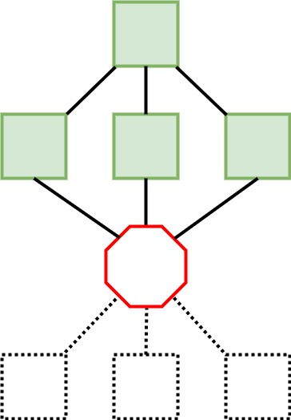
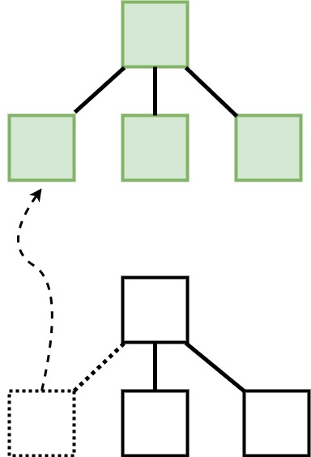

# Firefox Release Promotion
### the &#9731; model
##### Dec 2018

Aki Sasaki

Note:
- Hi, I'm Aki Sasaki from Release Engineering
- This is Firefox Release Promotion: the &#9731; model

---

## Release promotion

Four phases:

- **_build_** shippable, release-configured builds on push
- **_promote_** build to candidate build
- **_push_** candidate build to mirrors
- **_ship_** signed-off candidate build to users

Note:
- Release promotion has four discrete phases.
- We need to be able to defer each subsequent phase until humans make a decision.

---

## Old model: breakpoint

Note:
- In the old model, we scheduled a single release graph that kept phases separate with a breakpoint task.
- When we manually resolved the breakpoint task, the next phase would run.

---
## Old model: limitations

Note:
- Sometimes, the second half of the graph would exceed its deadline before it ran.
- Or we found a taskgraph bug after scheduling the entire graph.
- In these cases we had to reschedule the second half of the graph manually.
- Automated off-cycle partner repacks were completely unsupported in this model. So we SSHed into partner-repack1 and copy/pasted commands from a wiki to repack and release-sign them manually.

---
## Taskgraph / `existing_tasks`

Note:
- Taskgraph allows for replacing a task in our current graph with a pointer to a task in a previous graph.
- We can do this for `n` tasks.
- Chain of trust verification also supports verifying `n` upstream tasks and taskgraphs.
- This tells us that artifacts were created by a trusted worker, using taskgraph configurations from a revision in a trusted tree

---
## &#9731; model

Note:
- Enter the &#9731; model
---
## &#9731; phases

Note:
- In the &#9731; model, each section represents a release promotion phase
- a build base
- a promote torso
- a push head
- and a ship hat
---
## &#9731; `existing_tasks`

Note:
- We schedule a promote torso with a build base, but replace all the tasks in the build base with the existing tasks in a previous build base.
- Effectively we're building a promote torso on top of the previous build base, depending on its tasks and artifacts.
---
## sequential

Note:
- For the most part, we run each phase sequentially, one by one: the build base, then the promote torso, then the push head, then the ship hat.
- But the &#9731; model can also handle other, more complex scenarios.
---
## `n` phase graphs

Note:
- For instance, it's valid to schedule `n` instances of a phase graph.
- Here we've scheduled the push head three times.
- Perhaps the first head broke due to network or infra issues.
- When those cleared up, we ran the second head, and found a bug in the taskgraph.
- We landed a fix, and scheduled a third head off the newer revision, against the existing promote torso and build base, and that went green.
- This saves time during time sensitive chemspill releases.
- This also lets us quickly test new patches in staging; just iterate over the phase we're changing without rebuilding the full stack
---
## RC builds

Note:
- For RC builds (.0 Firefox builds that we want to ship to the release channel), we first want to ship to the beta channel.
- We create a special promote-rc torso that can ship to the beta channel first, represented by the torso holding a broom.
- Then we create a ship-rc graph, represented by the propeller beanie hat, to ship that candidate to the beta channel.
- If we need an RC2, we start over. New revision, build base, promote-rc torso, ship-rc propeller beanie hat.
- When we're ready, we add the push head and ship hat, and we've shipped the RC to the release channel.
---
## off-cycle partner repacks

Note:
- off-cycle partner repacks
- In this analogy, partner repacks are the buttons in the promote torso, so we get them for free when we do a Firefox release
- However, we often need to respin the partner repacks in the 6 weeks between scheduled releases
- We can schedule a 2nd promote torso, and replace all the tasks with the existing tasks of the first promote torso *except for the buttons*. We effectively respin just the buttons (partner repacks) based on the previous promote torso's tasks and artifacts.
- We can do this at a cadence completely independent of the Firefox release cadence.
---
## defer-mar-signing

Note:
- defer-mar-signing
- In the near future, we'll be able to defer release-signing our update artifacts, until we get a quorum of human signoffs on the mar manifest.
- We can schedule a promote torso up to but not including mar-signing, giving us half a promote torso
- When we get signoff, we can schedule a full promote torso, and replace all the tasks that exist in the previous half-torso. We effectively create the missing top half of the promote torso, and we can proceed building the &#9731; as normal.
---
## defer-release-signing

Note:
- defer-release-signing
- This is not currently on the roadmap, but we could do this.
- Currently we release-sign our beta/release/esr builds on push.
- We only promote a handful of those builds. Essentially, we release-sign many builds that we have no intention of shipping.
- If we wanted to, we could sign our builds with a development key on push.
- When we schedule the promote torso and build base, we could also replace every task in the build base with tasks in the previous build base, except for the build-signing, repackage, and repackage-signing tasks, and replace those with release-signing tasks. This means we would only release-sign the builds that we promote to candidate builds.
---
## nightly promotion (shippable)

Note:
- Nightly promotion, aka shippable builds
- This is on the roadmap, and I'm hoping we can get to it in H1.
- Currently, our nightly graph follows a different workflow than our release promotion graphs.
- We want the two workflows to converge.
- Create shippable, nightly-configured builds on push, and at some cadence, schedule the full &#9731; and replace the tasks in the build base, shipping the last good nightly builds to the nightly channel without human intervention.
- This would make our nightly and release workflows consistent, and give us up to 6 weeks of additional testing for any release promotion changes that land on central, before we uplift to beta.
---
## &#9731; model
aki@mozilla.com / @aki / :aki

Note:
- That's the &#9731; model and what it allows us to do.
- Q/A?
